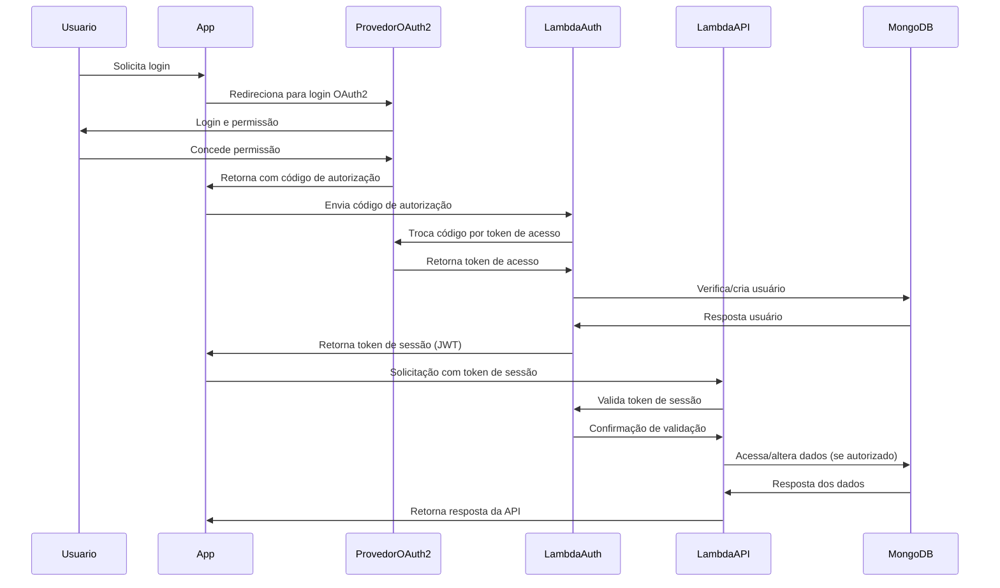

# Infra

```mermaid
sequenceDiagram
    participant Usuario
    participant App
    participant ProvedorOAuth2
    participant LambdaAuth
    participant LambdaAPI
    participant MongoDB

    Usuario->>App: Solicita login
    App->>ProvedorOAuth2: Redireciona para login OAuth2
    ProvedorOAuth2->>Usuario: Login e permissão
    Usuario->>ProvedorOAuth2: Concede permissão
    ProvedorOAuth2->>App: Retorna com código de autorização

    App->>LambdaAuth: Envia código de autorização
    LambdaAuth->>ProvedorOAuth2: Troca código por token de acesso
    ProvedorOAuth2->>LambdaAuth: Retorna token de acesso

    LambdaAuth->>MongoDB: Verifica/cria usuário
    MongoDB->>LambdaAuth: Resposta usuário
    LambdaAuth->>App: Retorna token de sessão (JWT)

    App->>LambdaAPI: Solicitação com token de sessão
    LambdaAPI->>LambdaAuth: Valida token de sessão
    LambdaAuth->>LambdaAPI: Confirmação de validação
    LambdaAPI->>MongoDB: Acessa/altera dados (se autorizado)
    MongoDB->>LambdaAPI: Resposta dos dados
    LambdaAPI->>App: Retorna resposta da API
```
